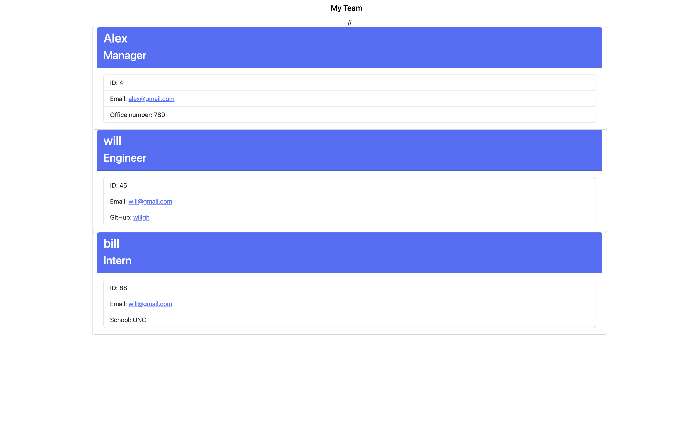
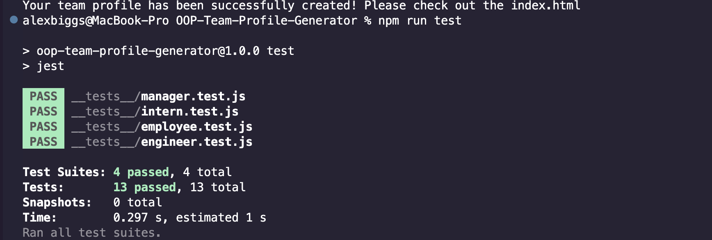

  # OOP Team Profile Generator
  
  ## Description
  
  * The Team Profile Generator is a command-line-input application which is ran using NodeJS. Once initiated, the application requests information from the user about members of an engineering team and generates a HTML file displaying the information the user input. The HTML file can then be ran in a web browser where the information the user gave will be displayed in an easy to read format.  

*Video walkthrough of how to initiate and run the application:* https://app.castify.com/view/7673e1b3-c38b-4a0d-89f3-de43247e4383
  
  ## Table of Contents
  
  * [Installation Instructions](#Installation-Instructions)
  * [Usage](#Usage)
  * [Contributing](#Contributing)
  * [Tests](#Tests)
  * [License](#License)
  * [Acknowledgements](#Acknowledgements)
  * [Questions](#Questions)
  
  ## Installation Instructions
  
  * Clone the repository to your local machine. You should also have Git Bash and Node.js installed. You'll need to run npm install from the terminal at the root directory of the local repository to install the application's dependencies (fs, inquirer, and jest).

  After all packages and dependencies have been installed, type "node index.js" in the command line to initiate the application. 

  
  
  ## Usage
  
  * Anyone is free to use the application. Please provide credit to me if you do chose to use this. 

  
  ## Tests
  
  * Testing has only be ran locally. Further testing can be done by running "npm run test" in order to verify the proper output of each class. 

  
  
  ## License
  
  * This application is licensed under the MIT license type.
  
  ## Acknowledgments
  
  * 
  
  ## Questions
  * If you have any questions regarding the application, please reach out to **Alex Biggs** (the creator), at their GitHub profile located here: **https://github.com/afbiggs**.
